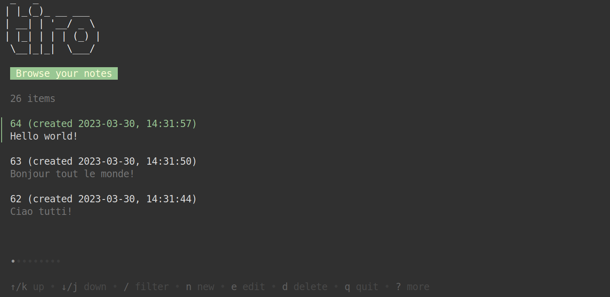
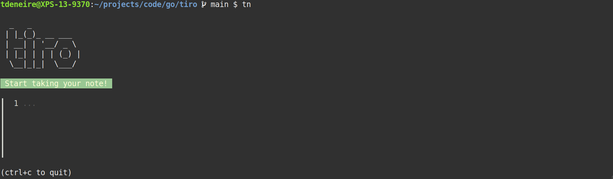
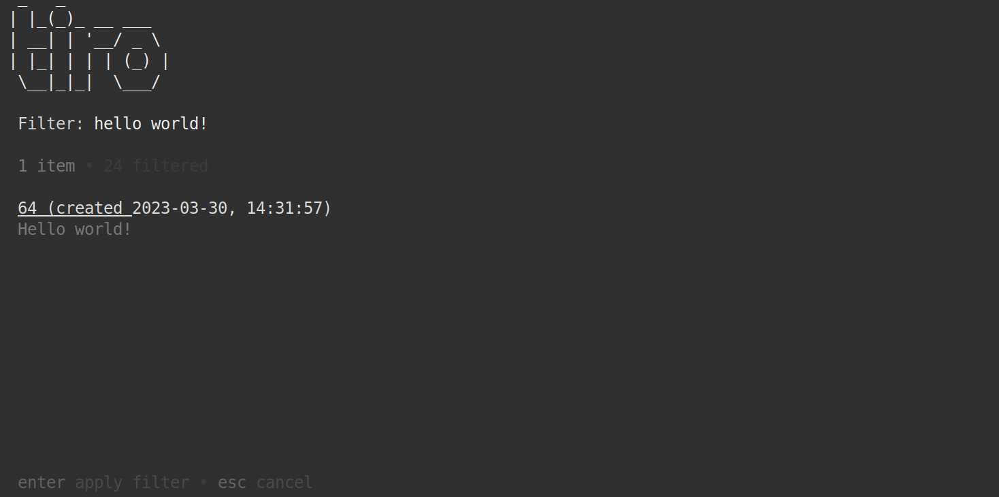
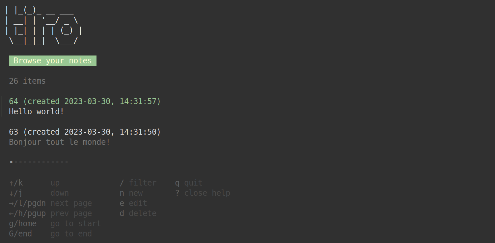

# Tiro

Tiro is a *very* simple note-taking TUI ("text-based user interface"). It was named after Marcus Tullius [Tiro](https://en.wikipedia.org/wiki/Marcus_Tullius_Tiro) (died 4 BC), famous secretary of [Cicero](https://en.wikipedia.org/wiki/Cicero).




## Use case

Tiro is meant for taking a quick note in a terminal session.

In the past, whenever I needed to jot something down - say, a phone number, for instance - my go-to solutions were the following. Either I would switch to a browser and open Google Docs, which means leaving the terminal environment and some clicks to create a new document. Or, I would fire up my terminal-based editor of choice, which is [Neovim](https://neovim.io), which is quicker, but did leave me with the annoying task of picking a file name and a location to save the file to. A file, by the way, that I would then forget about and would have trouble relocating afterwards.

With `tiro` I now have a tool that allows me to start writing a note with one quick terminal command. In my `.bashrc` the instruction `tn` is an alias for `tiro tui take`, which creates a new note:




## Functionality

As said, `tiro` is really a very basic application. Besides simple CRUD ("Create Update Delete") functionality, it also offers a way to browse notes and filter them with fuzzy searching:



The application also comes with basic "help" functionality:



## Architecture

Under the hood, `tiro` is a Go application that exposes both a TUI and a CLI. Both use the same API for creating/updating, reading and deleting notes, which uses SQLite as a database back-end.

The CLI is made with the [Cobra](https://github.com/spf13/cobra) framework:

```
  _   _
 | |_(_)_ __ ___
 | __| | '__/ _ \
 | |_| | | | (_) |
  \__|_|_|  \___/

tiro is a CLI application for note taking

Usage:
  tiro [command]

Available Commands:
  about       Information about `tiro`
  arg         Alternative ways to start tiro
  command     Command functions
  completion  Generate the autocompletion script for the specified shell
  delete      Delete a note
  help        Help about any command
  info        Note info
  read        Read a note
  take        Take a note
  tui         tiro TUI

Flags:
  -h, --help   help for tiro

Use "tiro [command] --help" for more information about a command.
```

For instance:

```bash
tiro take "hello world"
cat myfile.txt | tiro take
```

The TUI is made with the excellent [Charm TUI toolkit](https://charm.sh). It's main components are the [Bubble Tea](https://github.com/charmbracelet/bubbletea) library, which is for building and running the terminal app itself, and the [Bubbles](https://github.com/charmbracelet/bubbles) library, a collection of terminal UI components like text areas, list interfaces, and so on. A third library I made use of, is [Lip Gloss](https://github.com/charmbracelet/lipgloss) which is a terminal style and layout toolkit.

The Charm TUI ecosystem is really good and accessible. Bubble Tea comes with a beginner-friendly tutorial and all of the libraries are well-documented. The Bubble libraries also offers example implementations of the different UI components, which is really handy.


## Feedback

The `tiro` TUI/CLI is still very much in an alpha-stage, but I am very open to any feedback you might have on the project. Please open an issue or submit a pull-request!
